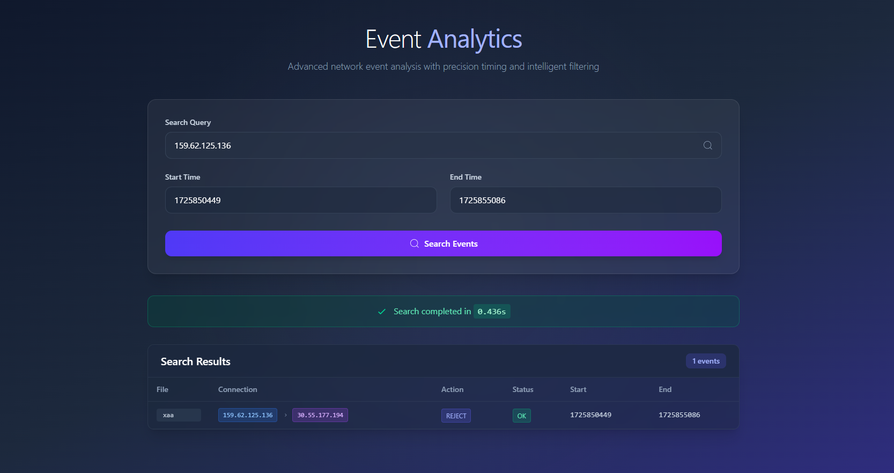

# UI


# Use container

- [Frontend Docker Image](https://hub.docker.com/r/vivkus/frontend)
- [Backend Docker Image](https://hub.docker.com/r/vivkus/backend)
- docker pull vivkus/frontend:latest
- docker pull vivkus/backend:latest
- docker run --name my-frontend -p 80:80 vivkus/frontend:latest
- docker run --name my-backend -p 8000:8000 vivkus/backend:latest
- open localhost:80 for frontend
- open localhost:8000 for backend

- 


# Event Search Backend (Django)


### TESTED WITH LOCUST FOR 10+ SIMULTANEOUS API CALLS WITH ASGI 4 WORKER NODE


## Setup & Installation


1. **Clone the repository and navigate to the backend directory**

2. **Install dependencies**
   ```bash
   pip install -r requirements.txt
   ```

3. **Ensure your event data files are in the `events/` folder at the project root.**

4. **Apply migrations**
   ```bash
   python manage.py migrate
   ```

5. **Run the development server**
   ```bash
   uvicorn eventsearch.asgi:application --workers 4
   ```
   The API will be available at `http://localhost:8000/api/search/`

## API Usage

### POST `/api/search/`
- **Body (JSON):**
  - `search_string`: (string) IP or field-based query (e.g., `dstaddr=221.181.27.227`)
  - `start_time`: (epoch, int)
  - `end_time`: (epoch, int)
- **Returns:**
  - List of matching events, file name, and search time

## Production
- For concurrent requests, use Gunicorn or Uvicorn:
  ```bash
  gunicorn eventsearch.wsgi:application --workers 4
  # or for async
  uvicorn eventsearch.asgi:application --workers 4
  ```
## locally
- use uvicorn eventsearch.asgi:application --workers 4 --host 127.0.0.1 --port 8000

## locust testing
- cd backend
- locust -f locustfile.py --host=http://localhost:8000       


## Notes
- The backend scans all files in the `events/` folder for every search.
- CORS is enabled for local frontend development. 


# Event Search Frontend (React + Vite + Tailwind)

## Setup & Installation

1. **Navigate to the frontend directory**
   ```bash
   cd frontend
   ```

2. **Install dependencies**
   ```bash
   npm install
   ```

3. **Start the development server**
   ```bash
   npm run dev
   ```
   The app will be available at `http://localhost:5173/`

## Usage
- Enter a search string (IP or field-based, e.g., `dstaddr=221.181.27.227`), start time, and end time.
- Click "Search" to query the backend and view results.

## Notes
- The frontend expects the backend API to be running at `http://localhost:8000/api/search/`.
- Make sure CORS is enabled in the backend for local development.
